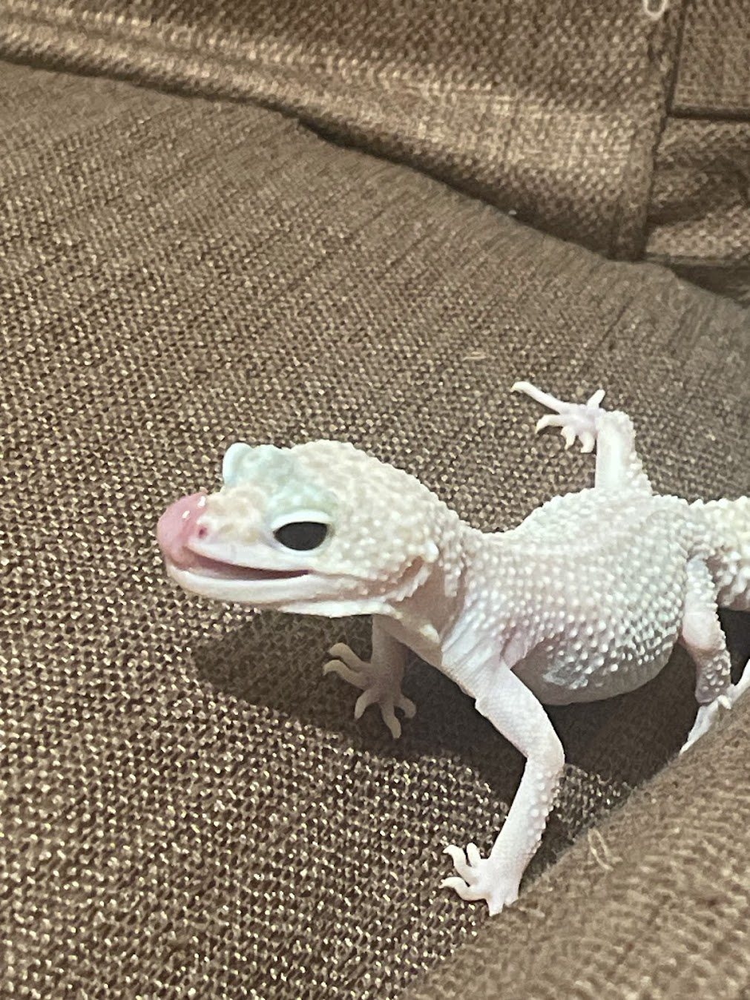

# Background

At some point in my life I got really obsessed with an idea of acquiring a lizard.

In effect, this specimen joined my household around spring last year:

Obviously, I could have just bought a pre built enclosure for her, with all the setup to control the conditions included - some even have mobile apps to help this purpose.

That would definetely be simpler, cheaper & faster.

Unfortunately for myselft, I have immense amounts of audacity mixed with being really stingy and so I thought "If I do as much as possible myself, it would be cheaper".

Spoiler alert: it wasn't cheaper.

It also:
- took forever
- made me think of giving up at least five times
- meant that it's still not finished at least 9 months after acquiring the gecko, and more than a year after this idea got planted in my head

If I started crowdfunding for Methylphenidate would people donate? Obviously not, no one reads this. THANK GOD. 

Anyway, back to the project.

The idea was to build a system that will allow for the following:

- control turning on and off the lamps (UV, heating, basking), as well as fans for ventilation and (haha) home made dehumidifier if needed (not needed really, and put me back a couple of months because I tried learning fluid dynamics to simulate airflow in the enclosure) 
- the above devices should be turned on either based on time of the day (e.g. lights off at night) or output from temperature/humidity sensors (turn on if too cold, or too humid)
- get the piCamera image to be able to see the gecc when I'm not at home
- display the current state of a system in some sort of web interface available online for me and my friends to watch
- the system would be contained in a wooden enclosure with glass sliding doors\
- the enclosure would be bioactive and filled with live soil, plants etc. together with the main tenant

This will be a series I guess. I wonder how many times I will abandon this. 

[back](./)
